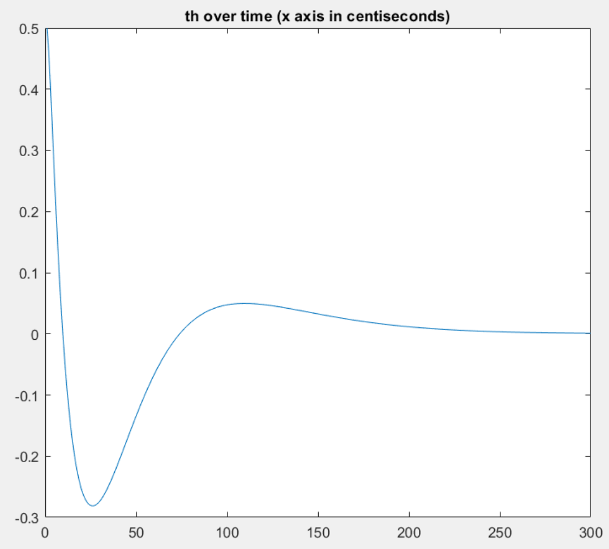
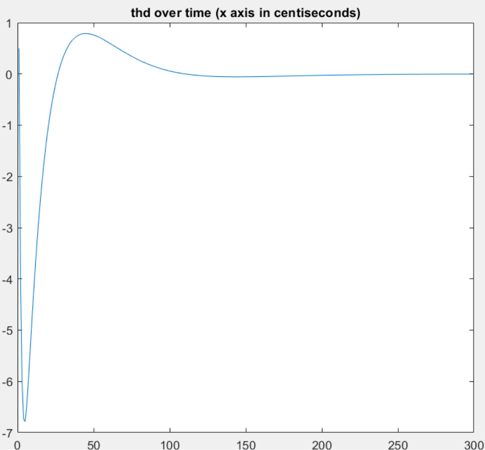
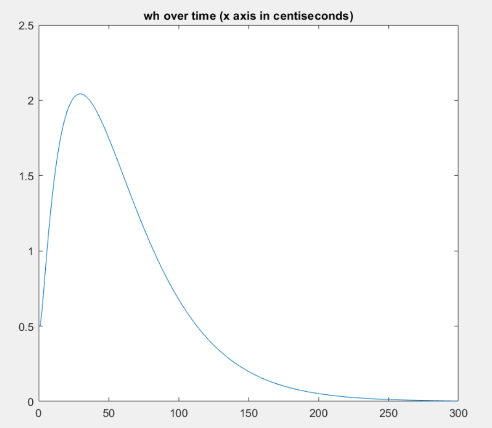
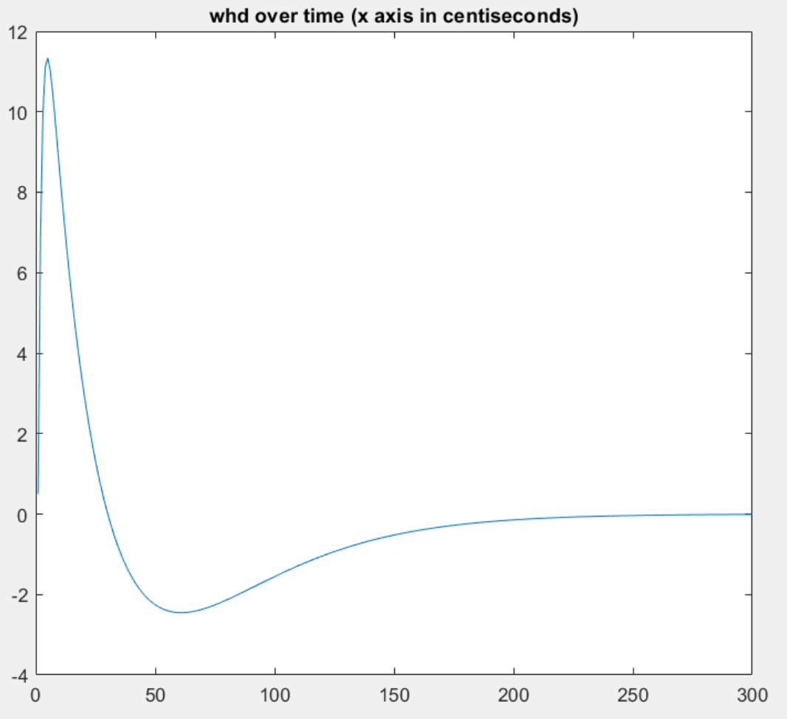
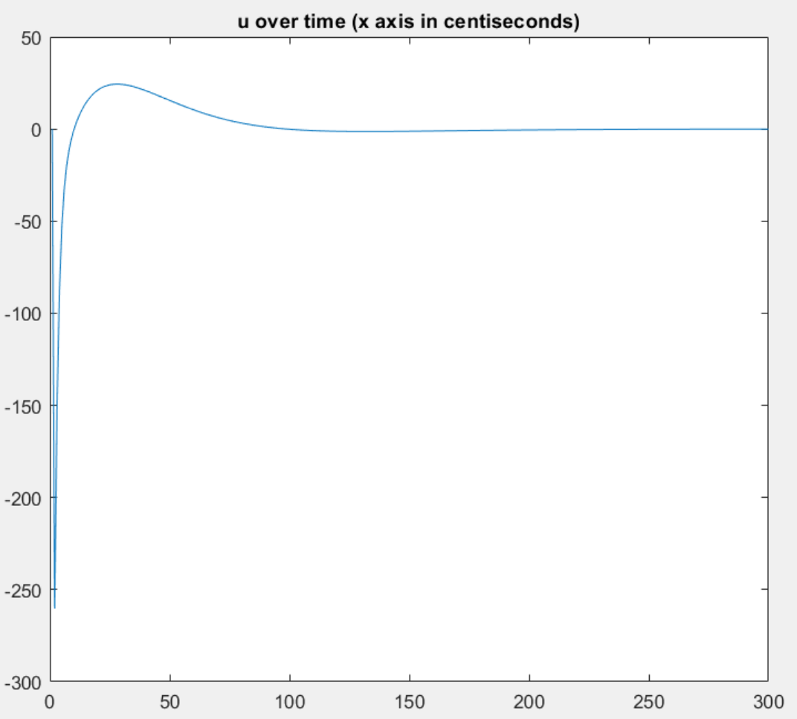

# 16299 Lab 2
In this web page, I describe how I built a LQR model to control a Twip in simulation.

## The Twip Model

The provided model can be seen below:

```
function [whdd thdd] = twip2( wh, whd, th, thd, motor_command )

% The parameters we assume we know perfectly
r_w = 0.0323; % m - wheel radius - easy to measure
g = 9.81; % m/s^2

% My best guess as to parameter values for unknown parameters
m_w = 0.173; % kg
m_p = 0.826; % kg
I_w = 0.0066; % kg-m^2
l_p = 0.043; % m
I_p = 0.00084; % kg-m^2
motor_viscosity = 0.0095; % Nm-s/radian
torque_scale_factor = 0.004; % Nm/command_units

% This version is expressed in terms of 3 unknown inertial parameters p1, p2, and p3
p1 = I_w + (m_p + m_w)*r_w*r_w; % a moment of inertia about the contact point
p2 = m_p*l_p; % a mass moment for the pendulum
p3 = I_p + m_p*l_p*l_p; % a moment of inertia of the pendulum about the wheel axle

% Compute the "mass" matrix in terms of the three inertial parameters p_i:
m12 = p1 + p2*r_w*cos(th);
M = [ p1  m12
      m12 (p1 + 2*p2*r_w*cos(th) + p3) ];
Minv = inv(M);

% Compute the right hand side (rhs) of the dynamics equations
v_exp = p2*r_w*thd*thd*sin(th);
v = [ (-torque_scale_factor*motor_command + v_exp - motor_viscosity*whd) (v_exp + p2*g*sin(th)) ];
rhs = transpose( v );

% And compute the accelerations
result = Minv*rhs;
whdd = result(1);
thdd = result(2);

end
```

I began by first trying to understand how the provided twip model worked and how it differed from the model in the previous homework. The provided model took in a twip state and a motor command and computed the accelerations. I extended this model to compute the new twip state by double integrating over a fixed timestep of 1/100 seconds.

```
function [wh_new whd_new whdd_new th_new thd_new thdd_new] = model(wh, whd, th, thd, u)

global DT;

% compute accelerations
[whdd_new thdd_new] = twip2(wh, whd, th, thd, u);

% compute velocities
vels = [whd thd] + [whdd_new thdd_new]*DT;
whd_new = vels(1);
thd_new = vels(2);

% compute positions
pos = [wh th] + [whd_new thd_new]*DT;
wh_new = pos(1);
th_new = pos(2);
```

## Computing A and B Matrices for LQR

In order to compute the A and B matrices for the twip, I initially tried to reverse engineer the code in the twip model file but found it too complicated. I had hoped that I could come up with a clean algebraic formulation and linearize the model that way. I ended up computing the jacobian of the model with respect to the state variables and commands centered around `x=[0,0,0,0]` and `u=[0]` via the finite difference method:

```f’(x) = (f(x+delta) - f(x-delta)) / (2 * delta)```

Using this jacobian, I was able to find the A and B matrices via using the tangent line approximation formula. The code can be seen below:

```
delta = .01;
DT = 1/100;
A = zeros(4);
% wh whd th thd
init_state = [0,0,0,0];
init_u = 0;

for i = 1:4
    u = init_u;
    state = init_state;
    state(i) = state(i) - delta;
    [wh_new whd_new whdd_new th_new thd_new thdd_new] = model(state(1), state(2), state(3), state(4), u);
    res_low = [wh_new, whd_new, th_new, thd_new];

    state = init_state;
    state(i) = state(i) + delta;
    [wh_new whd_new whdd_new th_new thd_new thdd_new] = model(state(1), state(2), state(3), state(4), u);
    res_high = [wh_new, whd_new, th_new, thd_new];

    deriv = (res_high - res_low) / (2*delta);
    A(:,i) = deriv;
end

state = init_state;
u = init_u - delta;
[wh_new whd_new whdd_new th_new thd_new thdd_new] = model(state(1), state(2), state(3), state(4), u);
res_low = [wh_new, whd_new, th_new, thd_new];

state = init_state;
u = init_u + delta;
[wh_new whd_new whdd_new th_new thd_new thdd_new] = model(state(1), state(2), state(3), state(4), u);
res_high = [wh_new, whd_new, th_new, thd_new];

B = (res_high - res_low) / (2*delta);
```

The computed LQR matrices can be seen below:
```
A =
    1.0000    0.0093   -0.0183         0
         0    0.9303   -1.8256         0
         0    0.0005    1.0159    0.0100
         0    0.0498    1.5873    1.0000


B =
   -0.0003   -0.0293    0.0002    0.0210
```

---

## Picking Q and R Matrices for LQR

I chose initial Q and R matrices to be the identity matrices as a first guess and it worked reasonably well in that the twip balanced. However, I noticed that it drifted to the side a fair bit. 

I realized that we needed to punish motor commands less in order to allow the controller to be more aggressive. As this is a simulator and there is no real “cost” for sending motor commands like battery power or physical limits, I set R to be extremely small. 

Additionally, I wanted to strongly penalize body angle th over all other metrics as a high absolute body angle typically signified disaster (tipping over). After trying a couple variations, I found the following to work well at keeping the twip upright and getting it to return to origin quickly.

```
Q = [ 20 0 0 0
      0 3 0 0
      0 0 50 0
      0 0 0 3 ];
R = .01;
```

## Computing LQR Gains

I used the MATLAB function `dlqr` to compute the LQR gains. The code can be seen below:
```
[Kc Sc Ec] = dlqr( A, B', Q, R )

Kc =

   31.4089   27.9839  399.4821   61.6703


Sc =

   1.0e+04 *

    0.1630    0.0504    0.3927    0.0719
    0.0504    0.0311    0.2443    0.0443
    0.3927    0.2443    2.1682    0.3597
    0.0719    0.0443    0.3597    0.0650


Ec =

   0.9683 + 0.0023i
   0.9683 - 0.0023i
   0.9473 + 0.0000i
   0.5166 + 0.0000i
```

---
## Results
A video of the balancing twip can be found [here](https://www.youtube.com/shorts/Z9wfQFzlwQo). The plots generated from a run of the simulation can be seen below. The duration was 3 seconds at a rate of 100hz.











---
## Simulator
The source code for the simulator can be found below:
```
global first_time
global DT;
first_time = true;

% settings
SAMPLES_PER_SECOND = 100;
DURATION = 3;
N = round(DURATION*SAMPLES_PER_SECOND);
DT = 1/SAMPLES_PER_SECOND;

x_array = zeros(N,2); % states
xd_array = zeros(N,2); % velocities
xdd_array = zeros(N,2); % accelerations
u_array = zeros(N,1); % commands

% model states
mx_array = zeros(N,4); % states

% state is wh, whd, th, thd
x_array(1,:) = [4, -1];
xd_array(1,:) = [5, 8];

mx_array(1,:) = [x_array(1,1) xd_array(1,1) x_array(1,2) xd_array(1,2)];

% lqr matrices
Kc = [31.4089   27.9839  399.4821   61.6703];

for i = 2:N
    if i == 2 || mod(i,25) == 0
        [i, x_array(i-1,1), xd_array(i-1,1), x_array(i-1,2), xd_array(i-1,2), xdd_array(i-1,1), xdd_array(i-1,2)]
    end
    
    % compute control
    u = -Kc * [x_array(i-1,1); xd_array(i-1,1); x_array(i-1,2); xd_array(i-1,2)];
    u_array(i,:) = u;

    % compute accelerations
    [ wh_new whd_new whdd_new th_new thd_new thdd_new ] = model(x_array(i-1,1), xd_array(i-1,1), x_array(i-1,2), xd_array(i-1,2), u);
    x_array(i,:) = [wh_new th_new];
    xd_array(i,:) = [whd_new thd_new];
    xdd_array(i,:) = [whdd_new thdd_new];
    
    % compute model positions
    mx_array(i,:) = A * mx_array(i-1,:)' + B * u;
    
    if abs(x_array(i,2)) > 5
        x_array = x_array(1:i,:);
        xd_array = xd_array(1:i,:);
        xdd_array = xdd_array(1:i,:);
        u_array = u_array(1:i,:);
        mx_array = mx_array(1:i,:);
        break
    end    
end

figure(2)
plot(x_array(:,1));
title( 'wh over time (x axis in centiseconds)' )

figure(3)
plot(x_array(:,2));
title( 'th over time (x axis in centiseconds)' )

figure(4)
plot(xd_array(:,1));
title( 'whd over time (x axis in centiseconds)' )

figure(5)
plot(xd_array(:,2));
title( 'thd over time (x axis in centiseconds)' )

figure(6)
plot(u_array(:,1));
title( 'u over time (x axis in centiseconds)' )
```